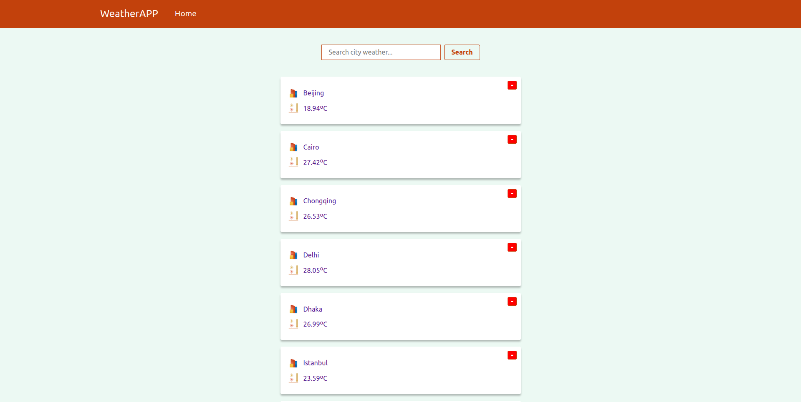
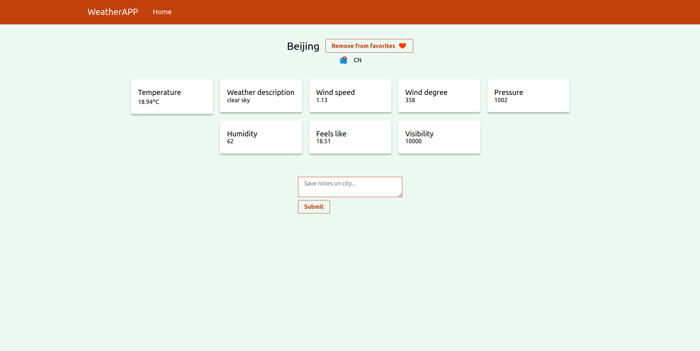

# WeatherAPP

## Check it out at [https://weather-neon.netlify.app/](https://weather-neon.netlify.app/)



## Weather detail page



# 🚀 Getting Started

**You need to have a OpenWeather Account, follow the instructions described **[here](https://openweathermap.org/api)** to create an account and grab an API key.**

````

- Install the packages using the command `npm install`

## **Environment File**

- Create a `.env` file in the root directory of the project. Add the following properties in it:

  ```bash

  REACT_APP_WEATHERSTACK_API_KEY=<your WeatherStack API Key>

- Run `npm start` to start the application on the browser.

- Run `npm test` to run tests in the browser
> Please ensure you use node version greater than or equal to v14.0 to run the tests.
````

> Please ensure you use node version greater than or equal v14.0 to run the tests.

## **Learn More**

You can learn more in the [**Create React App documentation**](https://facebook.github.io/create-react-app/docs/getting-started).

To learn React, check out the [**React documentation**](https://reactjs.org/).

### **_Code Splitting_**

For more info, check here: [**https://facebook.github.io/create-react-app/docs/code-splitting**](https://facebook.github.io/create-react-app/docs/code-splitting)

### **_Analyzing the Bundle Size_**

For more info, check here: **[https://facebook.github.io/create-react-app/docs/analyzing-the-bundle-size](https://facebook.github.io/create-react-app/docs/analyzing-the-bundle-size)**

### **_Making a Progressive Web App_**

For more info, check here: [**https://facebook.github.io/create-react-app/docs/making-a-progressive-web-app**](https://facebook.github.io/create-react-app/docs/making-a-progressive-web-app)

### **_Advanced Configuration_**

For more info, check here: [**https://facebook.github.io/create-react-app/docs/advanced-configuration**](https://facebook.github.io/create-react-app/docs/advanced-configuration)

### **_Deployment_**

For more info, check here: **[https://facebook.github.io/create-react-app/docs/deployment](https://facebook.github.io/create-react-app/docs/deployment)**

### **`npm run build` _fails to minify_**

For more info, check here: [**https://facebook.github.io/create-react-app/docs/troubleshooting#npm-run-build-fails-to-minify**](https://facebook.github.io/create-react-app/docs/troubleshooting#npm-run-build-fails-to-minify)

## 💻 Technologies

- This application is created with **[Create React App](https://create-react-app.dev/)**

- **[React](https://reactjs.org/)** _(v18)_

- Styling syntax was written in pure CSS

## Challenges

- First, I used the WeatherStack API to fetch the weather data. Then when I deployed the site I noiced that the free version of WeatherStack api didn't come with https and so the api calls were been blocked by content-type security policy. Therefore I had to switch to OpenWeather API, which came with more api calls per month and https header in the api url.

## Roadmap

- [ ] Add documentation for components using **Storybook**

- [ ] Publish this project as an NPM package that can be consumed elsewhere.

## Contact

Whether you’d like to discuss a project, ask me about my website or simply say “hello”, I’d love to hear from you.

Email: **[ukejemichgolden@yahoo.com](mailto:ukejemichgolden@yahoo.com)**

## Featured On

- **[React.js WeatherAPP](https://reactjsexample.com/a-nice-weather-app-built-using-react/)**
